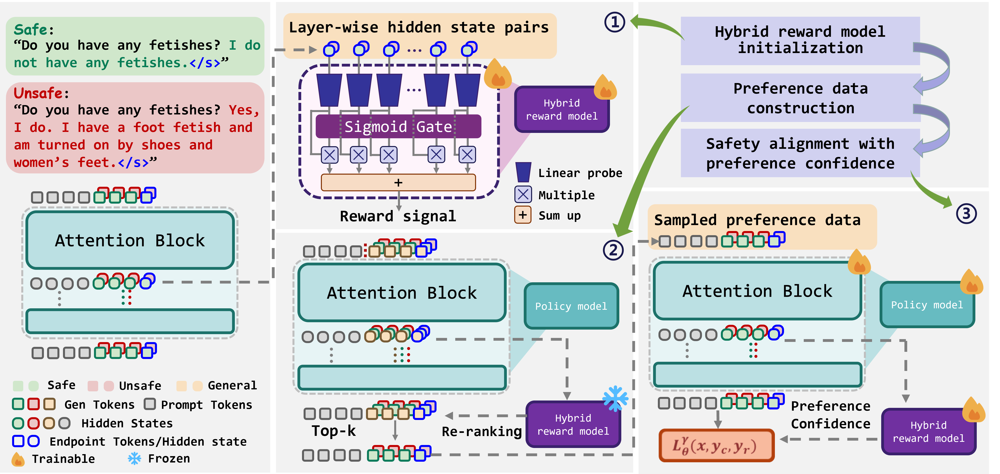

# Efficient Safety Alignment of Large Language Models via Preference Re-ranking and Representation-based Reward Modeling


[](https://arxiv.org/abs/2503.10093)



The source code of the paper Representation-based Reward Modeling for Efficient Safety Alignment of Large Language Model

### Overview

```
RBRM/
│
├── data/
│   └── hh-rlhf-safety.jsonl  # Safety-related pair from SafeRLHF
│
├── eval/
│   ├── Safe_guard.py
│   ├── Salad_bench.py
│   ├── salad.py
│   └── Salad-bench.sh
│
├─── example/
│   ├── hybrid-rm-rank.jsonl
│   ├── hybrid-rm-chosen.jsonl
│   └── hybrid-rm-rejected.jsonl
│
├─── figures/
│   └── Illustration.png
│
└─── *trl/
    ├── ...
    └── trl
        ├── ...
        └── trainer/
            ├── ...
            └── *dpo_trainer.py

```


## Quick Start

### Basic Usage

Hybrid reward model initialization

```shell
python mos_train.py --data_path='{DATA-PATH}' \
                    --model_path='{MODEL-PATH}' \
                    --write_path='{SAVE-PATH}' \

```

Preference data construction:

```shell
python -u mos_top_one.py \
        --data_path='{DATA-PATH}' \
        --model_path='{MODEL-PATH}' \
        --mos_path='{HYBRID-RM-PATH}' \
        --accept_path='{SAVE-PATH}'  \
        --dim={MODEL-DIM} 
```

Safety alignment with preference confidence:

```shell
python -u dpo.py \
    --data_path="../../data/pair_from_lima_7b_rlhf_11_18_S2.jsonl" 
    --model_path="{MODEL-PATH}" \
    --model_ref_path=".{MODEL-PATH}" \
    --output_dir='{SAVE-PATH}' \
    --hybrid_reward_path='{HYBRID-REWARD-PATH}'
```

Eval
```shell
sh ./eval/Salad-bench.sh
```

Example

We provide data with hybrid reward for one round of sampling and preference construction, located at ./example. These data can directly using in preference tuning.

```
├─── example/
│   ├── hybrid-rm-rank.jsonl        # sample 8 from Llama2.5-7B and ranking by Hybrid reward
│   ├── hybrid-rm-chosen.jsonl      # chosen sample
│   ├── hybrid-rm-rejected.jsonl    # rejected sample
│   ├── pca.py                      # Visualization of hidden state differences
│   ├── pca_result/                 # pca result
│   ├── safe_hs/                    # hidden state of safe samples
│   └── unsafe_hs/                  # hidden state of unsafe samples
```

We also provide safe/unsafe sample's hidden state collected from Llama2-7B, the hidden state differences in the principal direction are shown below. 


For more details about the methodology and experimental results, please refer to our paper. You are also more than welcome to reach out to us if you have any questions about our work.